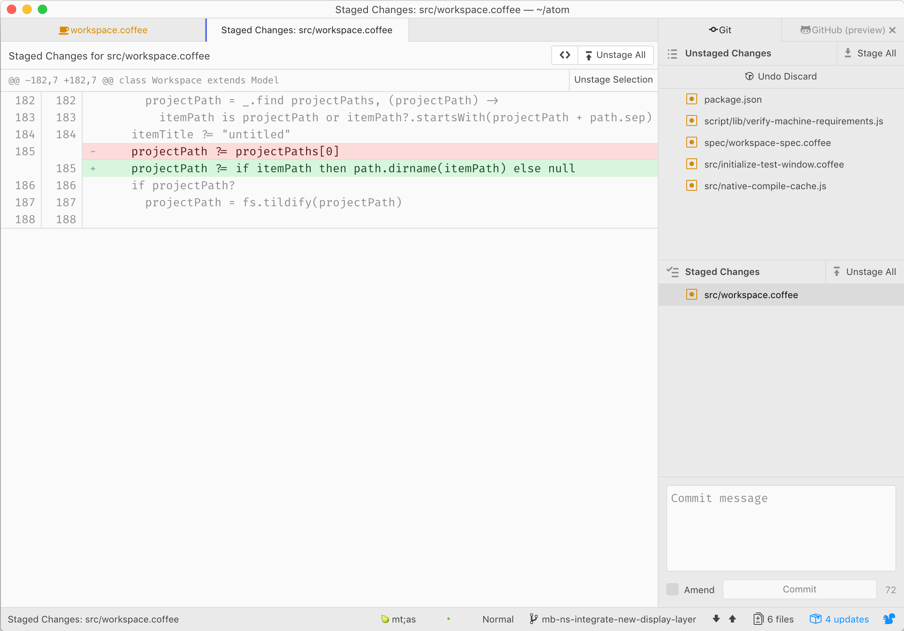
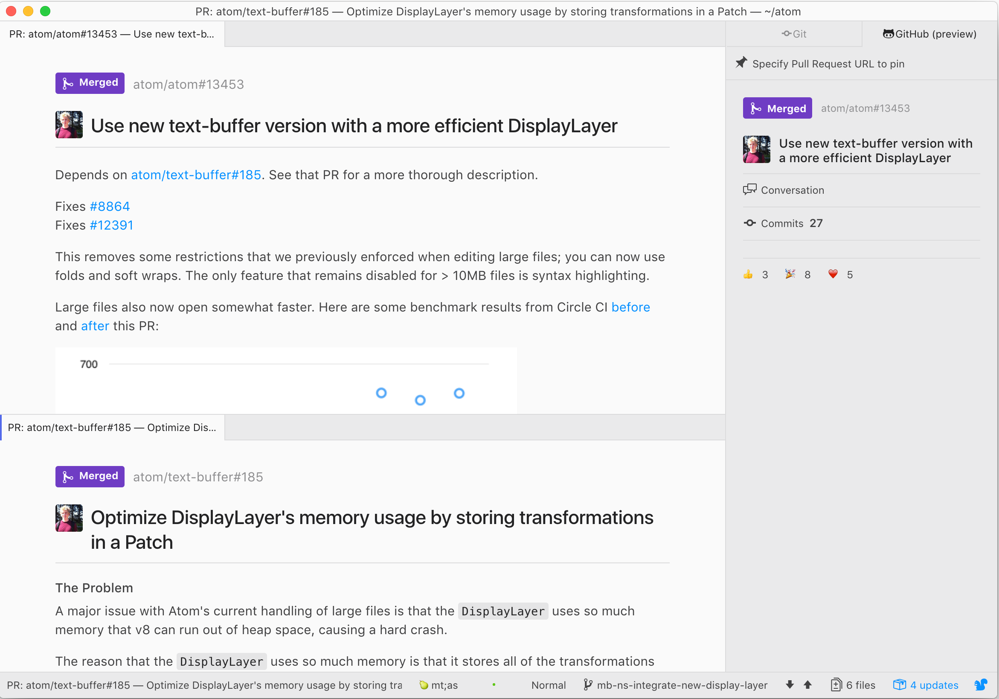
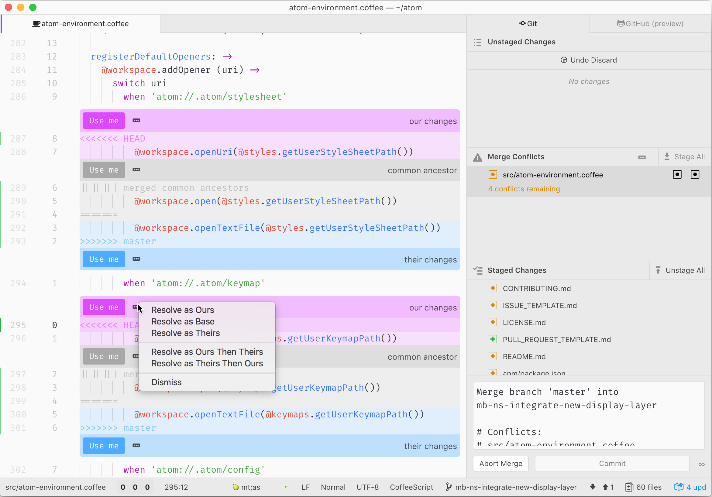

# Atom GitHub Package

The Atom GitHub package provides Git and GitHub integration for Atom. Check out [github.atom.io](https://github.atom.io) for more information.

## Installation

This package is bundled with Atom starting in version 1.18, and does not need to be installed separately.

## License

The MIT license grant is not for GitHub's trademarks, which include the logo designs. GitHub reserves all trademark and copyright rights in and to all GitHub trademarks.

GitHub® and its stylized versions and the Invertocat mark are GitHub's Trademarks or registered Trademarks. When using GitHub's logos, be sure to follow the GitHub [logo guidelines](https://github.com/logos).
