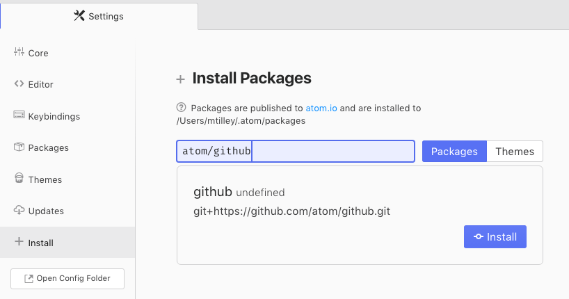

# Atom GitHub Package

The Atom GitHub package provides Git and GitHub integration for Atom.

## Installation

You may install the GitHub package via the Atom GUI or via the command line.

**Settings View**

In settings view, click "Install," enter the URL to the repository in the search field, and press enter. In the installation card that appears, click "Install."

**Command Line**

Run `apm install atom/github`.

## Keyboard Shortcuts

The default keyboard shortcuts are:

* `ctrl-9` :point_right: Show/hide the Git panel
* `ctrl-shift-9` :point_right: Toggle Git panel focus

From within the Git panel:

* `enter` :point_right: Stage/unstage the currently selected file
* `cmd/ctrl-enter` :point_right: Commit (or move to the commit box)
* `tab` :point_right: Focus the next list/commit box
* `shift-tab` :point_right: Focus the previous list

From within a diff view:

* `/` :point_right: Toggle between selection of hunks and lines
* `tab` :point_right: Move to the next hunk
* `shift-tab` :point_right: Move to the previous hunk
* `enter` :point_right: Stage/unstage the currently selected hunk or line

## Feedback

Please feel free to post your comments, feedback, and issues [in the GitHub repository](https://github.com/atom/github/issues).

## Current Status

This package is currently :construction: under heavy development. :construction: The following checked features are done, while others are in the works or are planned for the future:

**Git**

- [x] Stage files/hunks/lines
- [x] Unstage files/hunks/lines
- [ ] Discard changed files/hunks/lines
- [x] Create commits
- [ ] Commit signing ([#396]())
- [x] Change branches
- [x] Create new branches
- [x] Push/pull/fetch

**GitHub**

- [ ] Show current PR details
- [ ] Open a new PR
- [ ] Show PR comments inline in the editor
- [ ] Edit PRs
- [ ] Create/edit PR comments
- [ ] Perform GitHub.com code reviews from within Atom
- [ ] Merge/close PRs
